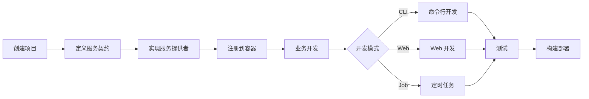

# Hade 框架核心概念图

## 框架核心设计理念

```
                    ┌──────────────────────────┐
                    │    Hade Web Framework    │
                    │   "一个有hade的框架"      │
                    └───────────┬──────────────┘
                                │
                ┌───────────────┴───────────────┐
                │                               │
        ┌───────▼───────┐              ┌───────▼───────┐
        │  服务容器模式   │              │  命令行优先   │
        │  (DI/IoC)     │              │  (CLI First)  │
        └───────┬───────┘              └───────┬───────┘
                │                               │
    ┌───────────┴───────────┐      ┌───────────┴───────────┐
    │                       │      │                       │
┌───▼───┐  ┌───────┐  ┌────▼──┐  ┌▼──────┐  ┌───────┐  ┌─▼─────┐
│服务契约│  │服务提供│  │依赖注入│  │命令管理│  │代码生成│  │开发工具│
│Contract│  │Provider│  │  DI   │  │ Cobra │  │  Gen  │  │  Dev  │
└────────┘  └────────┘  └───────┘  └───────┘  └───────┘  └───────┘
```

## 核心特性矩阵

| 特性类别 | 核心功能 | 技术实现 | 价值主张 |
|---------|---------|---------|---------|
| **依赖管理** | 服务容器 | IoC/DI 模式 | 解耦、可测试、易扩展 |
| **Web 服务** | HTTP/gRPC | Gin + gRPC | 高性能、标准化 |
| **命令行** | CLI 工具集 | Cobra | 开发效率、自动化 |
| **配置管理** | 分层配置 | Viper | 环境隔离、灵活配置 |
| **数据持久化** | ORM | GORM | 数据库无关、类型安全 |
| **缓存方案** | 多级缓存 | Redis + Memory | 性能优化 |
| **日志追踪** | 结构化日志 | 自研 + SLS | 问题定位、监控告警 |
| **开发体验** | 热更新 | FSNotify | 快速迭代 |

## 服务分层架构

```
┌─────────────────────────────────────────┐
│            业务代码层                    │ ← 开发者编写
├─────────────────────────────────────────┤
│                                         │
│  ┌─────────┐  ┌─────────┐  ┌─────────┐ │
│  │ Handler │  │ Service │  │  Model  │ │ ← 应用三层架构
│  └────┬────┘  └────┬────┘  └────┬────┘ │
│       │            │            │       │
├───────┼────────────┼────────────┼───────┤
│       └────────────┼────────────┘       │
│                    ▼                    │
│            ┌──────────────┐             │
│            │   Container  │             │
│            │  服务容器     │             │
│            └──────┬───────┘             │
│                   │                     │
│    ┌──────────────┼──────────────┐      │
│    │              │              │      │
│    ▼              ▼              ▼      │
│ ┌──────┐    ┌──────┐      ┌──────┐    │
│ │Config│    │  Log │      │  ORM │    │ ← 框架服务
│ └──────┘    └──────┘      └──────┘    │
│                                         │
└─────────────────────────────────────────┘
```

## 开发流程图



## 框架哲学

### 1. 约定优于配置
- 标准的目录结构
- 默认的配置规则
- 统一的命名规范

### 2. 服务化思维
- 一切皆服务
- 服务间解耦
- 易于替换和扩展

### 3. 命令行驱动
- 开发工具命令化
- 自动化代码生成
- 简化重复工作

### 4. 开发者体验优先
- 完善的开发模式
- 清晰的错误提示
- 丰富的调试信息

## 快速理解要点

```
Hade = 服务容器 + 命令行工具 + Web框架
     = (Spring Core) + (Rails CLI) + (Gin/Express)
     = 依赖注入 + 代码生成 + 高性能
```

## 适用场景

1. **中大型 Web 应用**
   - 需要良好架构支撑
   - 团队协作开发
   - 长期维护迭代

2. **微服务架构**
   - HTTP + gRPC 双协议
   - 服务治理能力
   - 分布式支持

3. **企业级应用**
   - 完善的日志追踪
   - 配置管理
   - 部署工具

4. **全栈开发**
   - 前后端协同
   - 开发模式支持
   - 统一工具链