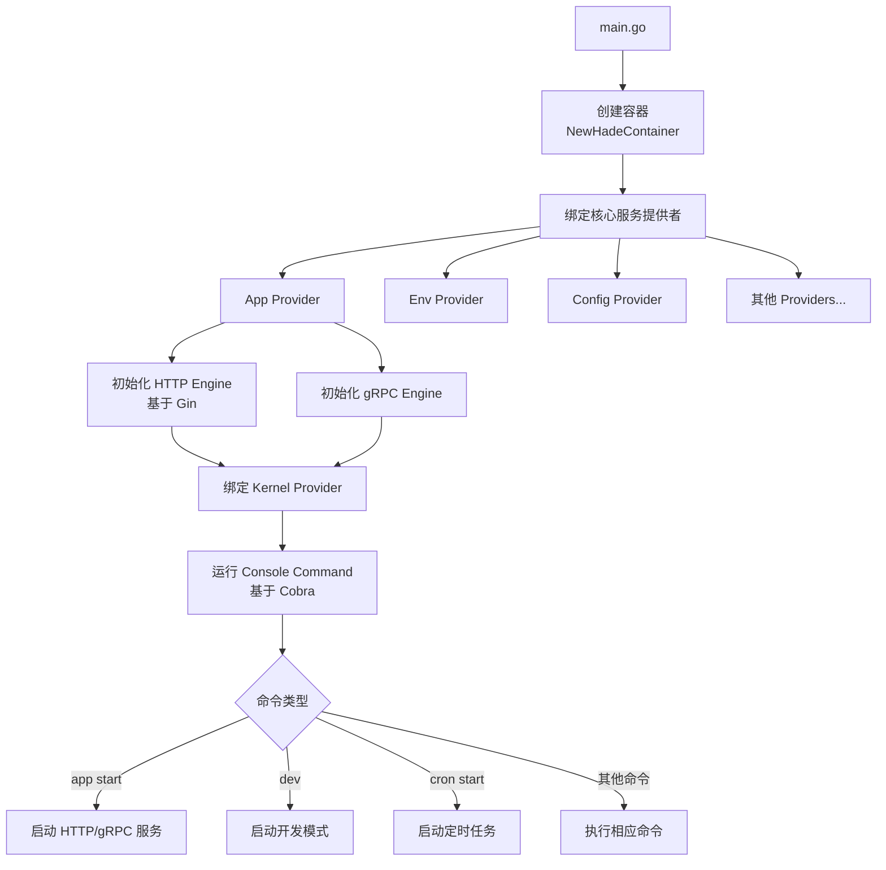
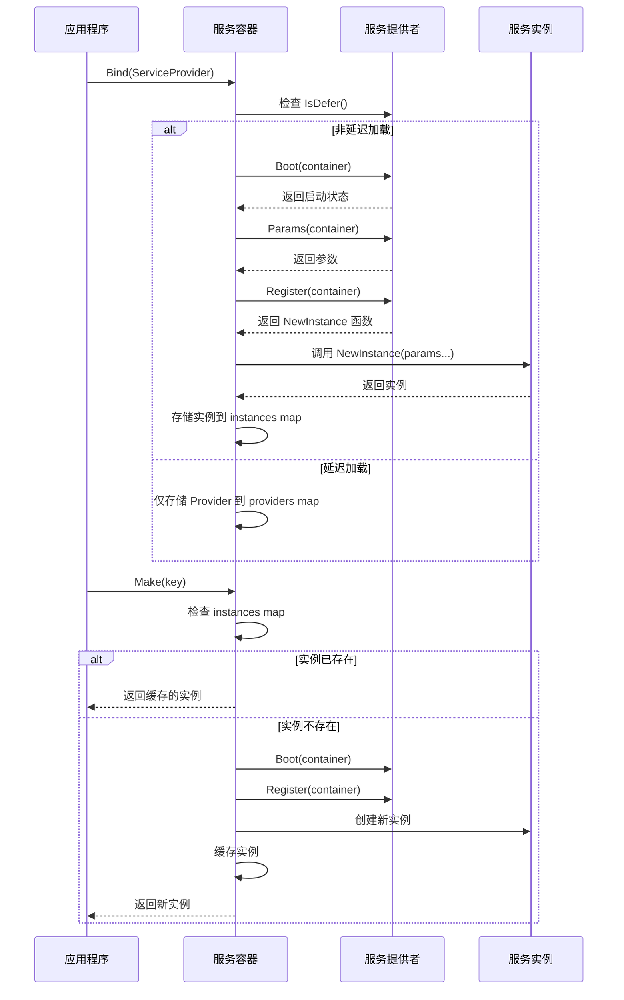
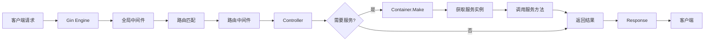
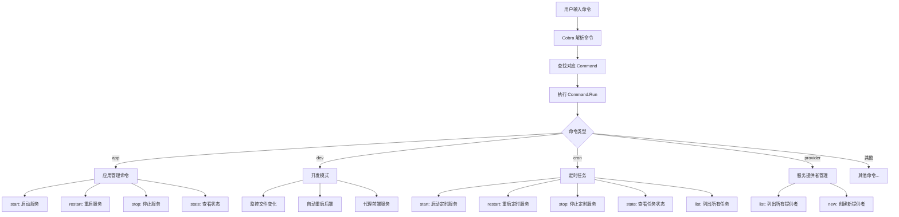
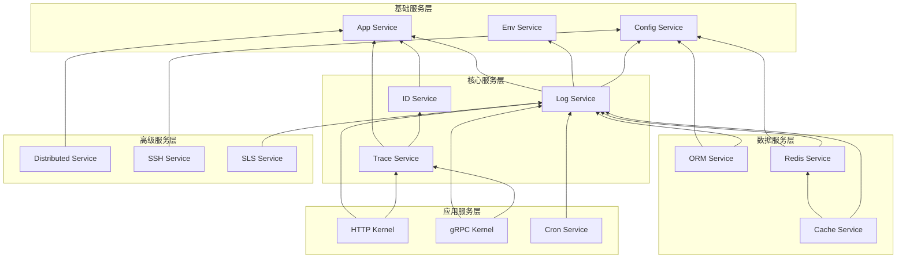
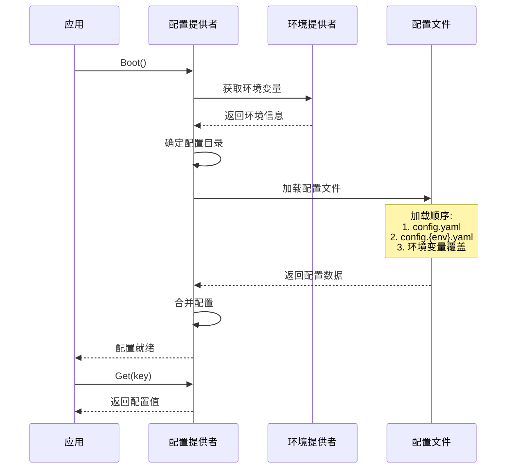
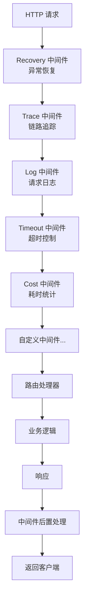
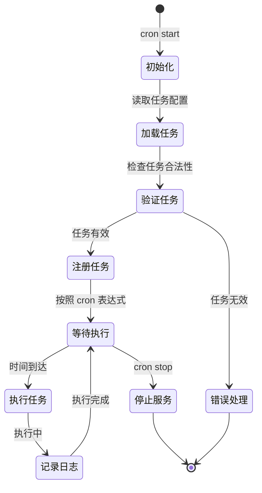
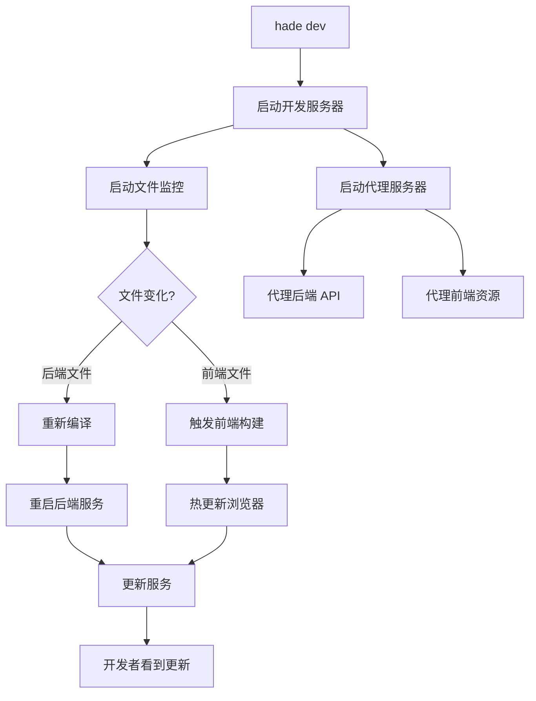
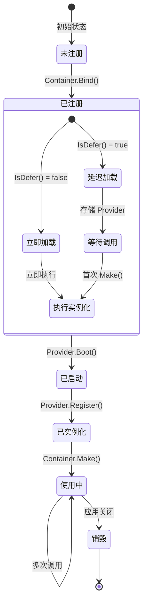

# Hade 框架详细数据流和调用关系图

## 1. 应用启动流程

## 2. 服务注册与依赖注入流程

## 3. HTTP 请求处理流程

## 4. 命令执行流程

## 5. 服务层级依赖关系

## 6. 配置加载流程

## 7. 中间件执行链

## 8. 定时任务执行流程

## 9. 开发模式工作流

## 10. 服务生命周期

这些详细的流程图展示了 Hade 框架的：
- 应用启动和初始化过程
- 依赖注入的完整流程
- HTTP 请求的处理链路
- 命令行工具的执行逻辑
- 服务之间的依赖关系
- 配置文件的加载机制
- 中间件的执行顺序
- 定时任务的生命周期
- 开发模式的工作原理
- 服务的完整生命周期